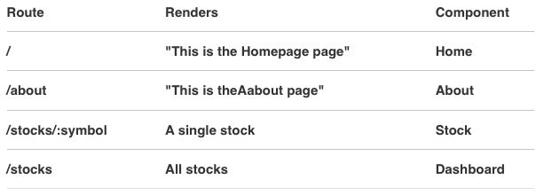
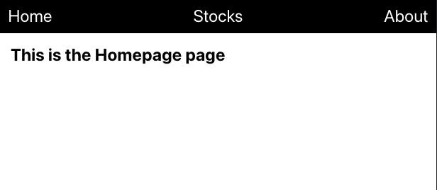
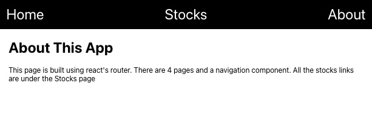
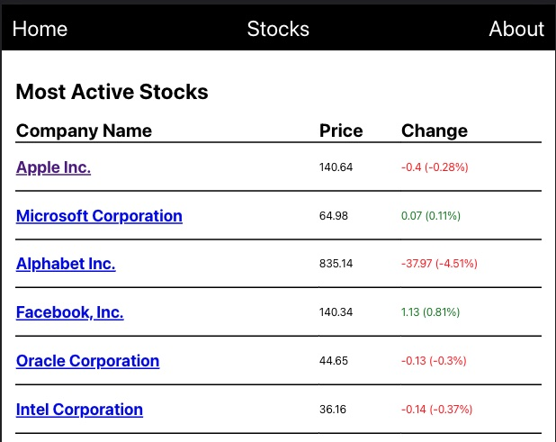
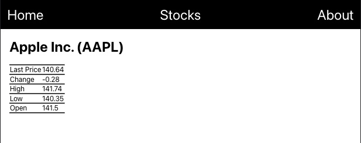

# React Router Stock App

This app is built using react router. 

The routing table:

## Navigation

No matter what route the user is visiting, they always see a navigation bar at the top of the window. It contain links to "Home", "Dashboard" and "About" pages.

## Dashboard (/stocks)

If a user visits /stocks or clicks "Home" in the navigation bar, they will be directed to a dashboard page. This page should list all of the stocks that the user is tracking, specifically their name and symbol. These stocks are pulled from data.js file in src/resources folder.

## Stock (/stocks/:symbol)

If a user clicks on one of the stocks listed in the Dashboard view, they will be directed to an individual stock show view. This view displays all of a stock's attributes.

## About (/about)

If a user clicks on "About" in the navigation bar, they will be directed to an about page. This is just a static page that displays a description of the app.

## Screenshots of the app pages

